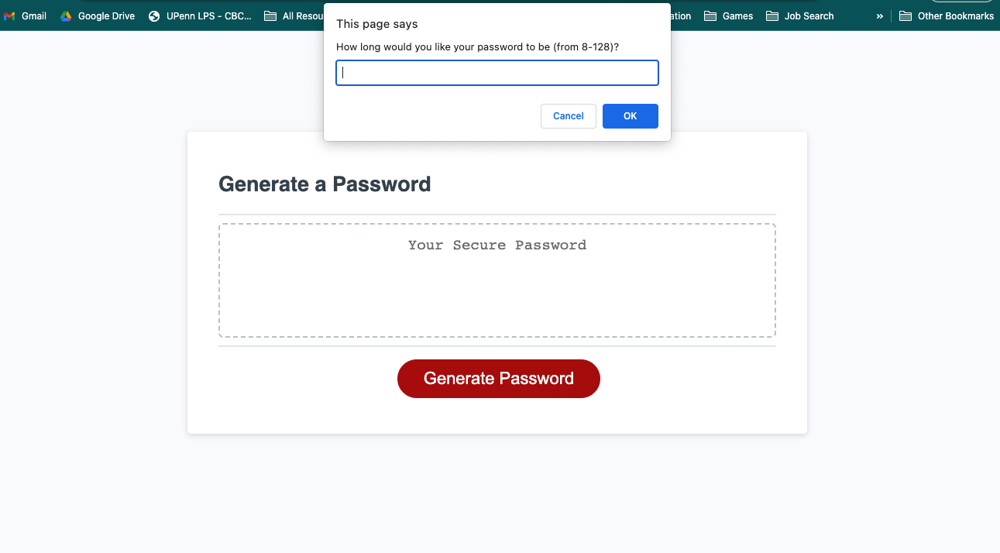

# <Random Password Generator>

## Description

This website allows the user to generate a random password for security purposes. Whether the user need a password for personal or professional reasons, they'll be able to generate a random password that will help them keep their accounts secure. The generator allows the user to choose a desired password length and what types of characters they'd like to include, so that they can generate a password that meet any website's specific criteria.

## Installation

No installation required. Just follow the link to the webpage.

## Usage

Website Link: https://oconnell-coder.github.io/random-password-generator/

GitHub Repo Link: https://github.com/OConnell-Coder/random-password-generator

## License

MIT License

## Features

The generator allows the user to choose a desired password length and what types of characters they'd like to include, so that they can generate a password that meet any website's specific criteria. The character options are: numbers, lowercase, uppercase, and special characters.